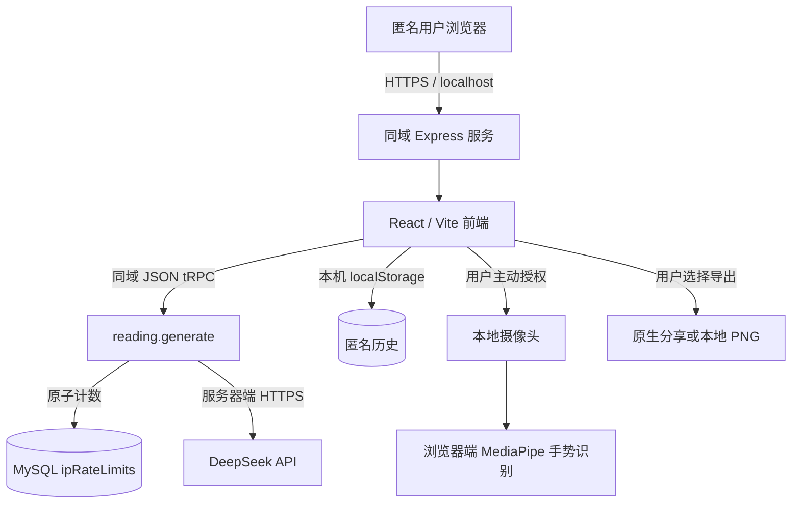

# 六爻占卜 MVP

一个**匿名优先**的中文六爻占卜 Web 应用。用户输入所问之事后，可通过三枚 3D 铜钱逐爻投掷、一键成卦，或摄像头手势投掷；应用据六爻规则计算本卦、变卦与动爻，加载本地经文，并由服务器端 DeepSeek 调用生成两类文化解读。

> **使用边界：** 本项目及人工智能生成内容仅用于《周易》文化研究、一般信息与娱乐参考。它不构成医疗、投资、法律、税务或其他高风险决策建议。完整文本见网页中的[免责声明](/disclaimer)。

## 目录

- [版本边界与当前状态](#版本边界与当前状态)
- [核心功能与用户流程](#核心功能与用户流程)
- [系统架构与实际数据流](#系统架构与实际数据流)
- [目录结构与技术栈](#目录结构与技术栈)
- [本地安装、MySQL 与启动](#本地安装mysql-与启动)
- [环境变量](#环境变量)
- [DeepSeek 服务端解读](#deepseek-服务端解读)
- [匿名历史与 IP 限额](#匿名历史与-ip-限额)
- [摄像头与手势投掷](#摄像头与手势投掷)
- [两类解读的长图导出](#两类解读的长图导出)
- [随喜支持作者](#随喜支持作者)
- [隐私政策与免责声明](#隐私政策与免责声明)
- [安全审计与加固](#安全审计与加固)
- [测试、构建与部署](#测试构建与部署)
- [Railway 与 Cloudflare 生产部署](#railway-与-cloudflare-生产部署)
- [素材、验收与待确认事项](#素材验收与待确认事项)

## 版本边界与当前状态

当前 GitHub 仓库只能追溯至 **2026-03-03**。其后的任务、聊天记录、版本与部署信息均无法从仓库恢复。因此，下面将“原仓库可确认内容”“本次重建内容”“后续回忆补充的需求”明确分开；不应把 3 月 3 日的仓库误作最终版本。

| 来源 | 内容 | 当前状态 |
|---|---|---|
| 原仓库可确认 | React/tRPC/Drizzle 架构、六爻计算、64 卦静态经文、Three.js 硬币、MediaPipe 手势基础、结果页两类解读。 | 已保留并在当前基线上修复。 |
| 本次重建第一阶段 | 可安装/启动/构建/测试、同域 Express、MySQL 迁移、匿名 localStorage 历史、后端每日 IP 限额、DeepSeek 安全调用、手势状态机。 | 已实现；真实 DeepSeek 和真实摄像头真机验收待完成。 |
| 本轮补充需求 | 两类解读分别导出长图、原生分享/PNG 下载降级、随喜占位、隐私/免责声明网页、安全审计与整改。 | 已实现代码与测试；真实 AI 内容下的端到端导出、移动分享和真机摄像头仍需验收。 |
| Railway 上线与域名 | Railway 健康检查、构建/启动/迁移、同项目私有 MySQL、自动部署、临时域名、Cloudflare DNS 与正式域名绑定。 | 已在用户本人 Railway、GitHub 与 Cloudflare 账户中完成并通过健康检查；备份、成本上限和 DeepSeek Secret 仍有计划/账户边界。详见 `RAILWAY_LIVE_STATUS.md`。 |

## 核心功能与用户流程

主流程为：**输入问题 → 投掷六爻 → 计算卦象 → 加载经文 → 服务端生成两类解读 → 保存匿名历史 → 分别导出或分享解读长图**。每次投掷三枚硬币，正面计 3、反面计 2；6 为老阴动爻、7 为少阳、8 为少阴、9 为老阳动爻。六条爻按自下而上的顺序形成 6 位二进制本卦，仅翻转动爻形成变卦。

| 能力 | 当前实现 | 验收状态 |
|---|---|---|
| 提问与成卦 | 提问页、逐爻投掷与一键成卦。 | 已在本地浏览器验证。 |
| 3D 铜钱 | Three.js 渲染上抛、翻转、落地；手势蓄力影响动画视觉力度，不改变随机结果。 | 已构建验证。 |
| 手势投掷 | MediaPipe 识别握拳/张掌，含稳定时间、置信度、冷却和权限错误提示。 | 无摄像头错误路径已验证；HTTPS 真机待验收。 |
| 经文 | `client/public/data` 内的 64 卦映射及经文 JSON。 | 已纳入主流程。 |
| 两类 AI 解读 | **综合解读**与**卦象解读**分别由服务器返回结构化字段。 | 无 Key 的受控降级已验证；真实成功响应待新 Key。 |
| 匿名历史 | 浏览器 localStorage，刷新或重新打开同一浏览器后可见，最多 30 条。 | 已实现。 |
| 长图导出 | 每个解读页签独立导出问题、卦象、卦名、动爻、相关经文、解读及简短提示。 | 代码、缩放单元测试和构建已通过；真实长内容/手机分享待验收。 |
| 随喜 | 两个解读模块底部均有按需展示的微信、支付宝收款码和安全的 Ko-fi 外链。 | 作者明确授权的公开素材已接入；桌面/手机实际扫码与外链验收待完成。 |
| 法律页面 | `/privacy` 与 `/disclaimer`，全站免责声明组件提供入口。 | 已实现。 |

## 系统架构与实际数据流

前端和 API 由**同一 Express 服务、同一域名**提供。开发环境为 Express 挂载 Vite 中间件；生产环境为 Express 提供 Vite 构建产物和 `/api/trpc`。这避免了额外的跨域、跨站 Cookie 与摄像头权限复杂度。生产摄像头必须在 HTTPS 安全上下文中使用；浏览器通常将 `localhost` 视作本地开发例外。[1]



### 数据与能力边界

| 数据或能力 | 位置 | 实际行为 |
|---|---|---|
| 六爻随机投掷、卦象计算、静态经文读取 | 浏览器 | 不依赖模型；经文来自打包的 JSON。 |
| 问题、卦象与经文 | 浏览器 → 本项目服务器 → DeepSeek | 仅在用户请求 AI 解读时发送；请勿输入不必要的敏感个人信息。 |
| DeepSeek API Key | 服务器 Secret / `.env` | 只读取 `DEEPSEEK_API_KEY`；绝不使用 `VITE_*`，绝不发送到浏览器。 |
| 匿名历史 | 浏览器 localStorage | 键名 `liuyao_local_history`；当前匿名流程不写入服务器 `readings`。 |
| 每日次数 | MySQL | 保存 IP、UTC 日期和计数，仅用于服务端十次/日限额。 |
| 摄像头画面 | 设备本地浏览器 | 仅在用户启动并授权时用于 MediaPipe；当前代码不把视频帧上传到本项目服务器或 DeepSeek。 |
| 公开联系/Ko-fi | 构建时公开变量 | `VITE_CONTACT_EMAIL` 和 `VITE_KOFI_URL` 会打包进前端，**不得放任何秘密**。 |
| OAuth | 可选遗留能力 | 环境变量未齐全时不注册 OAuth 路由，匿名版不依赖 Cookie。 |

## 目录结构与技术栈

```text
Liuyao-mvp/
├── client/
│   ├── index.html                         # HTML、字体与元信息
│   ├── public/
│   │   ├── assets/                        # 铜钱贴图
│   │   ├── data/                          # 64 卦映射和经文 JSON
│   │   └── support/                       # 作者明确授权公开的微信、支付宝收款码
│   └── src/
│       ├── App.tsx                        # 页面路由
│       ├── components/
│       │   ├── CoinScene.tsx              # Three.js 硬币动画
│       │   ├── GestureThrowPanel.tsx      # 摄像头/手势状态 UI
│       │   ├── ReadingExport.tsx          # 长图生成、分享和下载降级
│       │   ├── SafeMarkdown.tsx           # 禁用原始 HTML 的模型输出渲染
│       │   ├── SupportAuthor.tsx          # 随喜按钮、二维码按需展示与 Ko-fi 外链
│       │   └── ScrollUI.tsx               # 书卷组件、政策入口
│       ├── hooks/                         # 手势、经文与 localStorage 历史
│       ├── lib/
│       │   ├── exportImage.ts             # 长图画布缩放保护
│       │   ├── liuyao.ts                  # 六爻纯函数
│       │   └── publicConfig.ts            # 联系/Ko-fi 公开配置
│       └── pages/
│           ├── ResultPage.tsx             # 两类解读、导出、随喜
│           ├── LegalPages.tsx             # 隐私政策与免责声明
│           └── Question/Throw/History...  # 主流程页面
├── drizzle/                               # schema、SQL 迁移与元数据
├── server/
│   ├── _core/security.ts                  # 安全响应头、JSON 与同源写保护
│   ├── _core/health.ts                    # Railway 数据库就绪检查
│   ├── _core/index.ts                     # Express 启动入口
│   ├── routers/reading.ts                 # 限流与 DeepSeek 调用
│   ├── db.ts                              # Drizzle/MySQL 入口
│   └── *.test.ts                          # 单元与安全回归测试
├── .env.example                           # 不含任何真实密钥的变量模板
├── drizzle.config.ts                      # Drizzle Kit 配置
├── pnpm-workspace.yaml                    # 版本化安全依赖覆盖
├── SECURITY.md                            # 可追踪安全审计与整改记录
├── RAILWAY_DEPLOYMENT_PLAN.md             # Railway、备份、预算与域名绑定计划
├── DEPLOYMENT_AUDIT.md                    # 已失效旧域名的只读核验记录
├── vite.config.ts / vitest.config.ts      # 构建与测试配置
└── REBUILD_BROWSER_NOTES.md               # 第一阶段浏览器验证记录
```

| 层次 | 技术 |
|---|---|
| 前端 | React 19、TypeScript、Vite 7、Tailwind CSS 4、Wouter、TanStack Query、tRPC React。 |
| 视觉与交互 | Three.js、Framer Motion、Radix UI、Noto Serif SC。 |
| 手势 | `@mediapipe/tasks-vision` GestureRecognizer，GPU 优先、CPU 回退。 |
| 长图与解读渲染 | `html-to-image`、Web Share API、`react-markdown`、`remark-gfm`。 |
| 后端 | Node.js 22、Express 5、tRPC 11、Zod、SuperJSON。 |
| 数据库 | MySQL 8、Drizzle ORM、Drizzle Kit。 |
| AI | DeepSeek Chat Completions API，默认 `deepseek-chat`。 |
| 测试与构建 | Vitest、TypeScript、Vite、esbuild、pnpm。 |

## 本地安装、MySQL 与启动

### 前置条件

请安装 Node.js 22+、pnpm 10+ 和 MySQL 8+。线上摄像头功能必须使用 HTTPS；本地开发可访问 `http://localhost:3000`。[1]

```bash
git clone https://github.com/Ritadu128/Liuyao-mvp.git
cd Liuyao-mvp
pnpm install --frozen-lockfile
cp .env.example .env
```

编辑被 Git 忽略的 `.env`，至少配置 `DATABASE_URL`。需要真实 AI 解读时，再填入 `DEEPSEEK_API_KEY`。不要将 `.env`、生产配置截图或真实 Key 提交到 Git。

```bash
# 开发：同一端口提供前端和 API
pnpm dev
# 浏览器： http://localhost:3000

# 生产构建和启动
pnpm build
NODE_ENV=production PORT=3000 pnpm start
```

### MySQL 初始化与迁移

匿名版数据库用于服务器端 IP 限流，也为未来可选 OAuth 历史预留表。匿名问题和解读不会写入 `readings`。

```sql
-- 本地开发示例：用强密码替换占位符
CREATE DATABASE liuyao_mvp CHARACTER SET utf8mb4 COLLATE utf8mb4_unicode_ci;
CREATE USER 'liuyao_app'@'127.0.0.1' IDENTIFIED BY 'replace-with-a-strong-password';

-- 运行时最小权限：不授予 DDL 或全局权限
GRANT SELECT, INSERT, UPDATE ON liuyao_mvp.* TO 'liuyao_app'@'127.0.0.1';
FLUSH PRIVILEGES;
```

迁移应由单独的受控运维账户或 CI/CD 步骤执行；生产应用账户不应拥有建表、删表或超级权限。

```bash
# 执行已提交 SQL 迁移
pnpm db:migrate

# 修改 drizzle/schema.ts 后生成迁移
pnpm db:generate

# 仅本地开发：生成后立即迁移
pnpm db:push
```

`ipRateLimits` 的 `(ip, date)` 唯一索引 `ip_rate_limits_ip_date_unique` 不可删除，否则并发下的限额正确性会受影响。

## 环境变量

以 `.env.example` 为模板。示例仅含变量名称或空占位符；真实 Key、密码和 Token 不能进入 README、Git 或任何 `VITE_*` 变量。

| 变量 | 是否必需 | 说明 |
|---|---|---|
| `NODE_ENV` | 否 | `development` 或 `production`。 |
| `PORT` | 生产环境必需 | Railway 自动注入；生产环境必须严格监听该值。本地开发缺失或无效时默认 `3000`。 |
| `DATABASE_URL` | 是 | MySQL URL；后端限流依赖它。 |
| `DEEPSEEK_API_KEY` | 真实解读必需 | 仅服务器读取；当前项目等待新的有效 Key。 |
| `DEEPSEEK_MODEL` | 否 | 默认 `deepseek-chat`。 |
| `DEEPSEEK_TIMEOUT_MS` | 否 | 服务器钳制到 3000–60000ms，默认 20000ms。 |
| `TRUST_PROXY` | 可信反向代理时必需 | 只有 Node 位于可信代理后时设 `true`。 |
| `VITE_CONTACT_EMAIL` | 否 | 公开展示的联系邮箱；当前默认值为作者授权的公开邮箱，部署时可覆盖。 |
| `VITE_KOFI_URL` | 否 | 仅接受 `https://` URL；当前默认值为作者授权的 Ko-fi 页面，部署时可覆盖。 |
| `JWT_SECRET`、`VITE_APP_ID`、`OAUTH_SERVER_URL` 等 | 否 | 未来 OAuth 预留；匿名版不需要。 |

## DeepSeek 服务端解读

当前已完成**可配置且安全的接入代码**，但因没有有效 `DEEPSEEK_API_KEY`，尚未验证真实成功响应。无 Key 时 API 返回受控“解读服务尚未配置”提示，且不会消耗 IP 限额。

1. 结果页收集问题、本卦、变卦、动爻、卦辞、象曰和动爻爻辞。
2. 浏览器同域调用 `reading.generate`，不会携带 DeepSeek Key。
3. 服务器先校验 Zod 输入和 Key；再对 IP/UTC 日期执行原子限流。
4. 服务器通过固定 HTTPS 地址 `https://api.deepseek.com/chat/completions` 请求 DeepSeek，并设置 AbortController 超时。
5. 服务器校验上游 HTTP 状态、`choices` 结构、JSON 文本与两项解读字段；仅验证通过后返回。
6. 浏览器将成功结果保存到 localStorage，并以安全 Markdown 渲染；原始 HTML 不会作为 DOM 执行。

提示词约束模型只能引用本次传入的经文原文，并保持客观中立，不作绝对预测。Key 准备好后，请仅写入服务器 `.env` 或部署平台 Secret，然后执行一次最小真实请求进行验收。

## 匿名历史与 IP 限额

匿名历史位于 `localStorage` 的 `liuyao_local_history`，最多保存 30 条，包括问题、六爻、本卦/变卦、动爻、两类解读与创建时间。清除浏览器站点数据、无痕窗口、换浏览器或换设备后，历史可能丢失，当前没有跨设备同步。

每次实际 DeepSeek 解读前，后端会以请求 IP 与 UTC 日期对 MySQL `ipRateLimits` 执行原子 UPSERT。每 IP 每日最多 10 次；第 11 次不递增并返回 `TOO_MANY_REQUESTS`。数据库不可用时接口失败关闭，不会绕过限额。`TRUST_PROXY` 默认为 `false`，仅在可信代理部署中启用，以避免伪造转发头影响 `req.ip`。

## 摄像头与手势投掷

用户必须主动点击“启动手势识别”并在浏览器中授权摄像头。权限被拒、没有摄像头、设备被占用、浏览器不支持或模型启动失败时，界面会显示中文原因。摄像头仅由浏览器端 MediaPipe GestureRecognizer 使用；停止识别或离开投掷页时会关闭媒体轨道。

| 阶段 | 判定 | 用户反馈 | 保护 |
|---|---|---|---|
| 未启动 | 未取得媒体流 | 摄像头预览占位和启动按钮 | 不预加载模型。 |
| 就绪 | 摄像头与模型就绪 | 实时镜像画面、“请握拳蓄力” | 仅接受置信度 ≥ 0.65 的手势。 |
| 蓄力 | `Closed_Fist` 稳定 ≥ 200ms | 0–100% 蓄力条 | 手势丢失或异常会取消蓄力。 |
| 释放 | `Open_Palm` 稳定 ≥ 200ms 且蓄力 ≥ 300ms | “已释放，正在投掷” | 复用原有单爻状态机。 |
| 冷却 | 手势触发后 | “投掷冷却中” | 两段 800ms 冷却、动画中锁定、六爻完成锁定。 |

> **真机验收：** 必须在 HTTPS 的手机及桌面浏览器上测试允许/拒绝权限、握拳—张掌、手势抖动、连续释放、摄像头占用、停止和路由离开。本环境没有可操作物理摄像头，因此不将此项标为已完成。

## 两类解读的长图导出

综合解读和卦象解读各有独立的“保存／分享长图”按钮。按钮只在本模块成功拿到解读内容后可用。

导出目标包含问题、卦象、本卦/变卦名称、动爻、可用经文、当前页签对应解读和页面内的简短免责声明；导出按钮、随喜二维码/链接等操作控件会通过 `data-export-ignore` 排除。`html-to-image` 先等待字体与图片解码，然后生成纵向 PNG。

| 场景 | 行为 |
|---|---|
| 支持文件分享的移动浏览器 | 用 Web Share API 交给系统分享面板；用户可选择微信等已安装应用或保存方式。 |
| 不支持原生文件分享的浏览器 | 自动下载 PNG。 |
| 用户取消系统分享 | 显示“已取消分享”，不误报失败。 |
| 原生分享异常 | 自动降级为 PNG 下载。 |
| 长内容/高分辨率 | 计算画布边长与总像素上限，自动降低清晰度而不裁切内容，避免常见 Canvas 内存/尺寸失败。 |
| 字体或生成错误 | 显示生成中状态或具体失败提示，允许重新尝试。 |

当前自动化测试覆盖普通手机宽度、高分辨率和极端超长内容的缩放边界。仍需在真实成功 AI 解读下，以手机小屏、高分辨率桌面和超长文本完成视觉导出及原生分享验收。

## 随喜支持作者

两个解读模块底部都显示“如果这个项目对你有帮助，欢迎随喜支持作者。完全自愿，不影响任何功能使用。”区域。作者已明确授权的微信与支付宝收款码位于 `client/public/support/`，Ko-fi 公开地址和联系邮箱由 `publicConfig.ts` 提供默认值；它们均可由公开的 `VITE_*` 构建变量覆盖。

为避免默认展示支付方式，组件初始只显示“显示微信收款码”与“显示支付宝收款码”按钮；用户点击其中一种后才按需加载对应二维码，再次点击可收起。Ko-fi 仅使用有效 HTTPS 地址，并输出 `target="_blank" rel="noopener noreferrer"` 安全外链。随喜区域带有 `data-export-ignore`，不会进入两类解读导出的长图。仍需在桌面和手机上完成二维码清晰度、实际扫码、触控区域和外链跳转验收。

## 隐私政策与免责声明

网页底部及结果附近都有政策入口：`/privacy` 为《隐私政策》，`/disclaimer` 为《免责声明》。政策以当前真实数据流为准，明确说明：问题/卦象/经文会在解读时传至服务器和 DeepSeek；匿名历史在 localStorage；服务器处理 IP 限额；摄像头在本地端处理；以及 Google Fonts、MediaPipe/jsDelivr、DeepSeek 和 Ko-fi 的第三方边界。

作者已提供公开联系邮箱，政策页面会通过 `PUBLIC_CONFIG` 显示它。每次实质性数据流、第三方服务或联系渠道变化都应复核数据保留期限、删除请求处理渠道和服务商清单；政策页面当前最后更新日期为 2026-08-28。

## 安全审计与加固

完整、可追踪记录见 [SECURITY.md](./SECURITY.md)。本记录是项目维护者的代码与本地运行检查，**不是第三方安全认证或渗透测试报告**。

| 分类 | 当前结论 |
|---|---|
| 已通过 | Key 仅服务端读取；匿名历史不写服务器；Drizzle 参数化访问；固定 DeepSeek URL；数据库限流原子性；匿名模式不使用 Cookie。 |
| 已修复 | 安全响应头与 HSTS 条件、CSP、同源 JSON 写保护、请求体上限、畸形 JSON 处理、严格 Zod 输入、生产调试清理、安全 Markdown、未使用高风险依赖移除、Express/Axios/Drizzle/tRPC 升级。 |
| 依赖审计 | 最终执行 `pnpm audit --prod --audit-level=low` 返回 **No known vulnerabilities found**。 |
| 仍需处理 | 真实 DeepSeek 成功/失败响应验收、依赖最小化与代码分割、单 IP 限流对代理/NAT 的天然限制。 |
| 需部署验证 | TLS/HSTS、可信代理 `TRUST_PROXY`、生产 CSP、未来 OAuth Cookie、MySQL 备份/恢复、HTTPS 真机摄像头生命周期。 |

安全响应头参考 Express、OWASP 与 MDN 的生产建议。[2] [3] [4] CSP 是纵深防御，不替代输入校验和安全渲染。[5]

## 测试、构建与部署

### 本地验证命令

```bash
# 安装后锁定依赖一致性
pnpm install --frozen-lockfile

# 类型检查
pnpm check

# Vitest：当前 9 个测试文件、44 项测试
pnpm test

# 生产构建
pnpm build

# 生产启动
NODE_ENV=production PORT=3000 pnpm start

# 生产依赖审计
pnpm audit --prod --audit-level=low
```

现有自动化测试覆盖六爻算法、固定卦、匿名权限边界、未配置 Key、限流原子语义、长图画布缩放、HTTP 安全头、同源写保护、畸形 JSON、登出 Cookie 清理、Railway 数据库就绪健康检查，以及生产/开发端口选择策略。

### 简单稳定的部署方案

建议使用**单一 Node 22 服务 + 托管 MySQL + HTTPS 反向代理或支持 Node 的托管平台**。该方案前后端同域，避免 CORS、跨站 Cookie 与摄像头权限问题。

> **当前生产状态：** `https://liuyao.win` 已在用户本人 Cloudflare 账户和 Railway 项目中完成绑定。一个 Railway GitHub Web Service 与一个同项目私有 MySQL 服务均在线，持续部署、迁移与 `/health` 已通过；非敏感验证记录见 [RAILWAY_LIVE_STATUS.md](./RAILWAY_LIVE_STATUS.md)。

1. 部署平台以服务器 Secret 配置 `DATABASE_URL`、`DEEPSEEK_API_KEY` 和生产公开元数据；不要把秘密设为构建时 `VITE_*`。
2. CI/CD 使用 `pnpm install --frozen-lockfile`、`pnpm check`、`pnpm test`、`pnpm build`；由受控迁移账户执行 `pnpm db:migrate`。
3. 通过 Caddy、Nginx 或托管平台提供有效 TLS 并反向代理到 `NODE_ENV=production pnpm start`。
4. 仅在 Node 确实位于可信代理后设置 `TRUST_PROXY=true`；否则保持 `false`。
5. 为 MySQL 配置最小权限、加密备份、恢复演练与数据库访问控制。部署后检查 HTTPS/HSTS、首页、同源 API、一次真实 AI 解读、IP 第 11 次限额、长图导出、隐私页面和真机手势。

### Railway 与 Cloudflare 生产部署

服务端新增 `GET /health`。它只返回 `{ "status": "ok" }` 或 `{ "status": "unavailable" }`，不泄露数据库连接、错误详情或任何 Secret；只有 MySQL 私有连接可用时才返回 HTTP 200。Railway 将在切换每一次新部署流量前检查此端点，因此生产迁移失败或数据库不可达时不会被误判为可用。

Railway Web Service 使用 `pnpm install --frozen-lockfile && pnpm build` 构建、`pnpm db:migrate` 作为部署前迁移、`pnpm start` 启动，并在平台注入的 `PORT` 上**严格监听**。生产端口缺失、无效或已被占用时服务会失败，而不会改用相邻端口；这可避免 Railway 健康检查与实际监听端口不一致。Web Service 的 `DATABASE_URL` 必须引用**同一 Railway 项目**中 MySQL 服务的私有 `MYSQL_URL`；不得为了连接应用而开启 MySQL Public Access。`DEEPSEEK_API_KEY` 由作者在 Railway Variables 中设置并 Seal，不能写入 Git、构建日志或 `VITE_*` 变量。

已先在 Railway 临时 `*.up.railway.app` 域名完成验收，之后才添加 `liuyao.win` Custom Domain。Cloudflare 根域 CNAME 与 Railway TXT 所有权验证记录均以 Railway 面板实际生成值为准；当前根域已启用橙云代理，Cloudflare SSL/TLS 模式为 `Full`。非敏感的实时绑定与验收记录见 [RAILWAY_LIVE_STATUS.md](./RAILWAY_LIVE_STATUS.md)。

Railway MySQL 原生 Backups/PITR 在当前 Trial 工作区仅对 Pro 计划可用，故 7 天保留期尚不能启用；不得自行升级或开放数据库公网访问。用户拟定的 Workspace Compute Usage 软提醒 `$10`、硬上限 `$20` 亦需升级/支付方式后才可设置。硬上限会使工作负载离线，仍应由用户本人决定。完整备份/支出运维方案见 [RAILWAY_DEPLOYMENT_PLAN.md](./RAILWAY_DEPLOYMENT_PLAN.md)。

## 素材、验收与待确认事项

| 待提供/待确认项 | 当前默认行为 | 后续动作 |
|---|---|---|
| DeepSeek API Key | 无 Key 时安全降级且不扣额度；先前误发到聊天的 Key 已由作者撤销。 | 作者仅在 Railway Secret 页面本人填入一枚全新的 Key；进行一次最小真实解读验收。 |
| 微信/支付宝二维码 | 作者授权的公开二维码已放入 `client/public/support/`，默认不展示，点击对应按钮后加载。 | 在桌面与手机实际扫码验收，确认二维码仍可用后再长期保留。 |
| Ko-fi 链接与联系邮箱 | 已接入作者提供的公开 HTTPS Ko-fi 地址与联系邮箱。 | 上线后复核外链目标、政策文案与联系渠道。 |
| Railway 与 MySQL | 同一 Railway 项目内的 Web Service 与私有 MySQL 已上线；迁移、`/health` 与 GitHub 自动部署已实测。 | 保持数据库私有；更新依赖或 Schema 后观察自动部署和迁移日志。 |
| 临时/正式域名 | Railway 临时域名保留；`liuyao.win` 已绑定 Railway 且经 Cloudflare 橙云代理，SSL/TLS 为 `Full`。 | 在正式域名完成手机摄像头、二维码、导出和分享验收。 |
| 备份与支出提醒 | 当前 Railway Trial 不提供 MySQL Backups/PITR；现有 `$5` 试用额度耗尽会自动停止服务。 | 若用户自行升级计划，再启用 7 天原生备份，并设置 `$10` 软提醒与 `$20` Compute 硬上限。 |
| 真机验收 | 当前仅验证无摄像头错误路径及自动化逻辑。 | 使用 HTTPS 手机/桌面完成手势、导出和原生分享验收。 |

## 参考资料

[1]: https://developer.mozilla.org/en-US/docs/Web/API/MediaDevices/getUserMedia "MDN: MediaDevices getUserMedia"
[2]: https://expressjs.com/en/advanced/best-practice-security/ "Express: Production Best Practices: Security"
[3]: https://cheatsheetseries.owasp.org/cheatsheets/HTTP_Headers_Cheat_Sheet.html "OWASP: HTTP Security Response Headers Cheat Sheet"
[4]: https://developer.mozilla.org/en-US/docs/Web/HTTP/Reference/Headers/Permissions-Policy "MDN: Permissions-Policy header"
[5]: https://developer.mozilla.org/en-US/docs/Web/HTTP/Guides/CSP "MDN: Content Security Policy"
